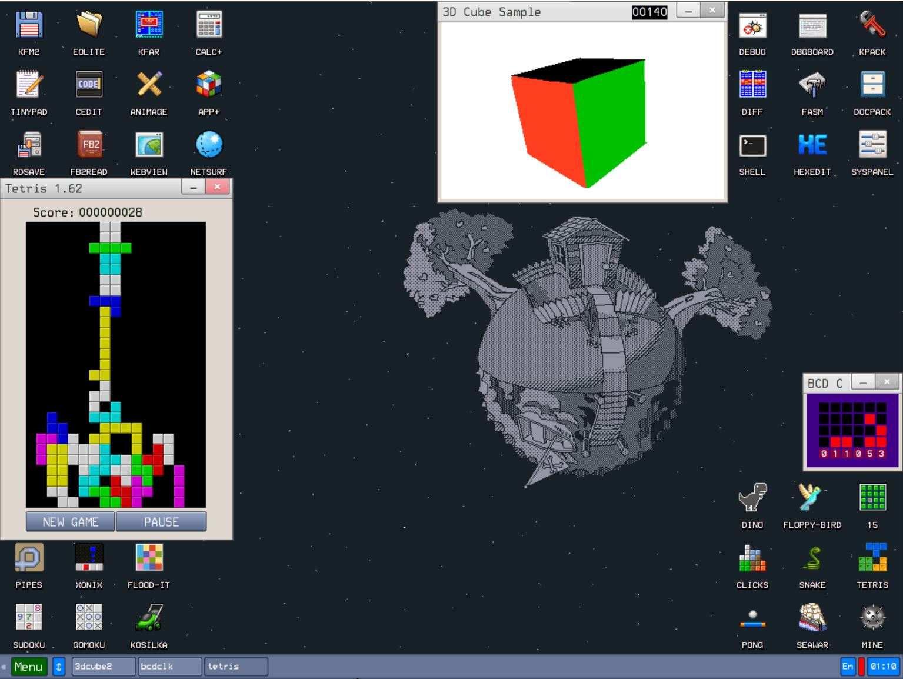

# UEFI4KOS-PANA-CFXZ6-Kolibri

UEFI4KOS EFI folder for Panasonic Let's Note / Toughbook CF-XZ6.

<p align="center">
  
</p>

<p align="center">
  
  
  
</p>

---

## 🎉 Tác giả

[](https://github.com/tpc-pascal/UEFI4KOS-PANA-CFXZ6-Kolibri/graphs/contributors)
<details open>
<summary><b>🔍 Các thành viên</b></summary>

| STT | Tên | Vai trò |
|:---:|:---|:---|
| 1 | [tpc-pascal](https://github.com/tpc-pascal) | Phân tích hệ điều hành |
</details>

## 💻 Cấu hình phần cứng (System Specs)
Danh sách phần cứng đã được kiểm chứng trên thiết bị thực tế:

| Thành phần | Chi tiết | Ghi chú |
| :--- | :--- | :--- |
| **Model** | Panasonic Let's Note CF-XZ6 | Toughbook series |
| **CPU** | Intel® Core™ i5-7300U (Kaby Lake) | 2 Cores / 4 Threads |
| **iGPU** | Intel® HD Graphics 620 | Metal Supported |
| **RAM** | 8GB LPDDR3 | |
| **Storage** | 256GB SSD (macOS) + 500GB HDD | |
| **WLAN/BT** | Intel® Dual Band Wireless-AC 8265 | ITWM / BlueToolFixup |
| **Ethernet** | Realtek RTL8111 | Native Support |

---

## 🛠 Tình trạng hoạt động (Status)

### ✅ Hoạt động (Working)
- [x] **Boot:** Vào được giao diện.
- [x] **...:** ....
- [x] **...:** ....
- [x] **...:** ....
- [x] **...:** ....

### ⚠️ Chưa ổn định (Issues/Bugs)
- [ ] **Thiết bị ngoại vi:** Chưa nhận diện được (xóa driver để bypass Setting mouse check)
- [ ] **...:** ....
- [ ] **...:** ....

---

## 📁 Cấu trúc thư mục

```
UEFI4KOS-PANA-CFXZ6-Kolibri/
├── EFI/
│   ├── BOOT/
│   └── KOLIBRIOS/
├── Tools/
├── .gitignore
├── CONTRIBUTING.md
├── CREDITS.md
├── GUIDE.md
├── LICENSE
├── README.md
└── kolibrios_CFXZ6.png
```

## 💌 Guide

Nếu bạn muốn tự làm thì hướng dẫn tại [GUIDE.md](./GUIDE.md)

## ✈ Hướng dẫn đóng góp

Đọc thêm tại [CONTRIBUTING.md](./CONTRIBUTING.md)

## 🙏 Nguồn tham khảo

Đọc thêm tại [CREDITS.md](./CREDITS.md)
